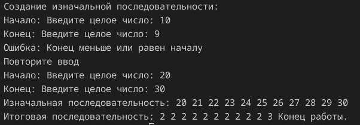
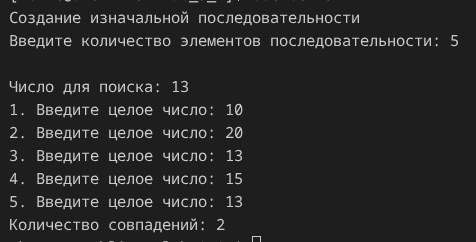
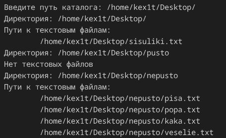

# Поморцев Аким КМБ-1 Лабораторная №3

# Задание 1

## Задача 1

### Текст задачи

Получить список из первых цифр чисел, содержащихся в исходной последовательности

### Алгоритм решения

Пользователь поочередно вводит целые числа для начала и конца последовательности, проверяем на правильность ввода, при ошибке выводим сообщение об ошибке и повторяем ввод. С помощью Seq.map каждый элемент последовательности отправляем в рекурсивную функцию, если при делении на 10 целая часть равна нулю, возвращаем число, иначе вызываем функцию с числом, деленным на 10. В итоге формируется последовательность из первых чисел исходной последовательности и выводится на экран. Программа завершает работу.

### Тестирование

# Задание 2

## Задача 1

### Текст задачи

Сколько раз в последовательности встречается заданное число?

### Алгоритм решения

Пользователь вводит число для сравнения, проверяем на правильность. Пользователь поочередно вводит целые элементы последовательности, проверяем на правильность ввода, при ошибке выводим сообщение об ошибке и повторяем ввод. С помощью Seq.fold проходим по последовательности и сравниваем элементы с искомым, если они равны, увеличиваем acc на один и возвращаем, иначе возврщаем неизменный. Выводим результат функции на экран. Программа завершает работу. 

### Тестирование

# Задание 3

## Задача 1

### Текст задачи

Вывести пути ко всем текстовым файлам (*.txt) в указанном каталоге и его подкаталогах.

### Алгоритм решения

Пользователь вводит путь, если ввод пустой, выходим, если ввод не пустой - проверяем директорию на существование, если несуществует - выводим сообщение. Если существует, проходим по всем каталогам внутри и ищем текстовые файлы внутри, если таковые имеются, выводим пути.

### Тестирование

